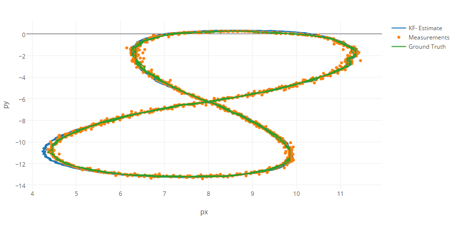
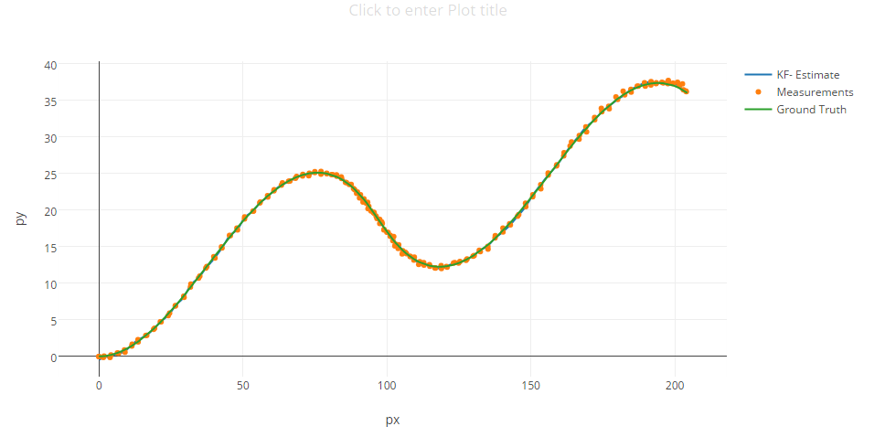
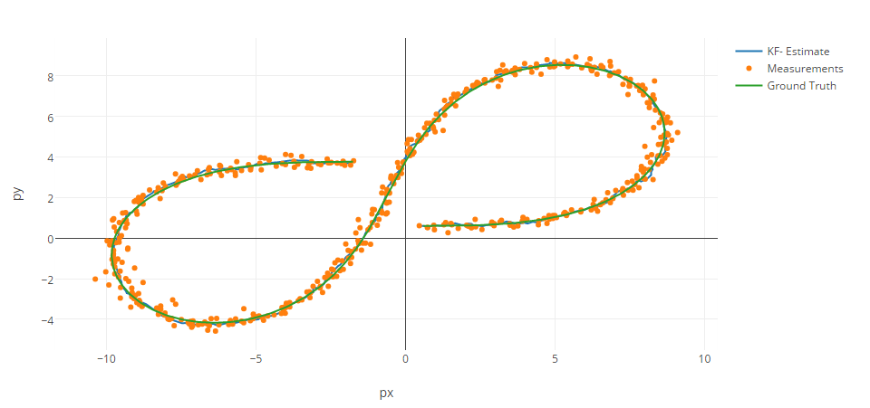

# Term2 - Project 1: Extended Kalman Filter
### Ajay Paidi

# Objective
The objective of this project is to implement an Extended Kalman Filter that could fuse sensor data from both radar and lidar data and perform object tracking.

# File structure
- **ReadMe.md**: This file
- **main.cpp**: The main executable program that loops through the input file measurements and calls the fusion extended kalman filter to get prediction outputs. This file is provided by Udacity and used as is.
- **FusionEKF.h** and **FusionEKF.cpp**: Contains the implementation of the fusion extended kalman filter. It primarily sets up the lidar and radar initialization matrices and then calls the kalman filter depending on the sensor type.
- **kalman_filter.h** and **kalman_filter.cpp**: Contains the implementation of the predict and measurement update steps.
- **tools.h** and **tools.cpp**: Utility class to compute RMSE and Jacobian.

# Description

## Kalman filter
A simple Kalman filter is generally used to track an object (position and velocity) by continuously updating a state prediction using measurements from a sensor. The following is a simple pseudocode illustrating this
```
    #Initialize state
    x = [p, v] #state contains postion and velocity
    for measurement in measurements:
        predict_state(x)
        update_state(x, measurement)
```
The Kalman filter deals with uncertainities in the system (process noise and measurement noise) by modelling them as zero mean Gaussian processes. The overall kalman filter logic can be elegantly expressed as a system of linear algebra equations that enables very efficient implementation.

## Extended kalman filter
One of the main drawbacks of a simple kalman filter is that it assumes a linear system. This assumption falls apart when one has to deal with measurements in non-linear space. One such example is Radar measurements which happen to be in polar coordinates. A simple Kalman filter cannot elegantly handle the non-linear mapping between polar and cartesian co-ordinate systems. The extended Kalman filter addresses this issue by applying a first order Taylor series expansion on the  non-linear function. This gives it the powerful capability to handle simultaneous measurements from multiple modalities and thus make it ideal for tasks such as sensor fusion (i.e. predicting state information based on multiple sensor input).

# Implementation
The general flow of the implementation is shown in the picture below.


# Results
The extended Kalman filter (EKF)  was tested on the datasets provided by Udacity and evluation metric used was RMSE (Root Mean Squared Error) between the predicted states and the provided ground truth values.
The RMSE for dataset 1 was [0.06, 0.06, 0.54, 0.54] and the visualization is shown below

The RMSE for dataset 2 was [0.18, 0.19, 0.47, 0.80] and the visualization is shown below

Finally the EKF was tried on a simulated dataset (generated by Matlab scripts provided by Mercedes Benz)


# Discussion
The EKF implementation seems to perform quite well on the provided datasets. However one could see the estimations deviating a bit near the curves and bends. Similarly the estimations deviate quite a bit when only radar data was used. This is expected because the EKF only tries to approximate non linear function values to the corresponding linear values.  

# References
- Starter code provided by Udacity / Mercedes Benz https://github.com/udacity/CarND-Extended-Kalman-Filter-Project.git.
- Udacity lecture videos / notes.
